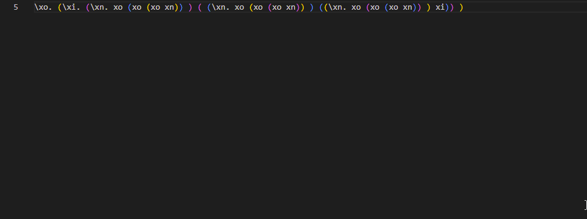

# bracket-viz

Take any amount of delimiter pairs (on a single line) and display them spaced out vertically to concisely emphasize complex nested pairs.

# Use
Select some text, right click and select the option `Visualize Delimiters`

Selecting it will display an in-line peek dropdown of the visualized text.

## Development Mentions

- Inspired by tedious tasks during Chapman University's Programming Languages course (Alex Kurz), in which we frequently dove into theory of Lambda Calculus, implemented in Haskell. 

- Numerous exercises had lambda calculus statements with a tremendous amount of nested parenthesis, which made pen and paper analysis of these statements a nightmare.

- The bracket colorization extension (now a native feature) helped some. However, a vertical space implementation sounded more useful and a fun idea for a final project.

- The VSCode extension development documentation is pretty bare bones. Pioneering a combination of concepts and objects in the documentation requires pure experimentation and problem solving.

- Even when finding similar questions (barely any on stackoverflow relating to my issues regarding peekLocations alternative), did not help much. Per a recommendation on github issues, I initially resisted going onto the VSCode slack, but gave up and got some pointers pretty quickly.
    - Lesson: Communities exist for a reason, reach out for help!

### Helpful References

[Extension API](https://code.visualstudio.com/api)

[VSCode URI Docs](https://github.com/microsoft/vscode-uri)

[Calling built in commands](https://code.visualstudio.com/api/references/commands)

### Extension Publishing

[Publishing Documentation](https://code.visualstudio.com/api/working-with-extensions/publishing-extension)

